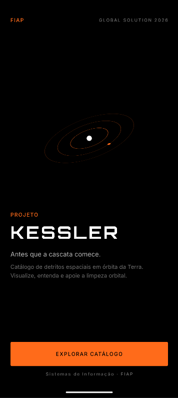
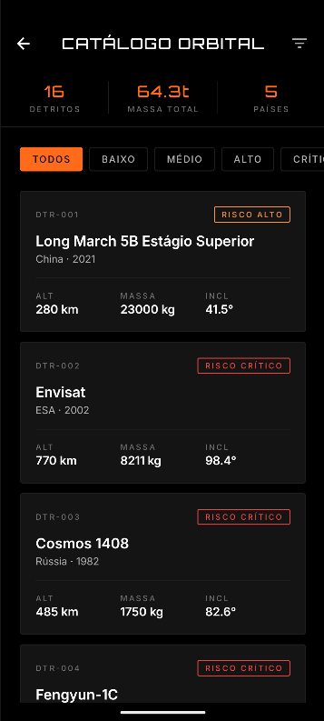
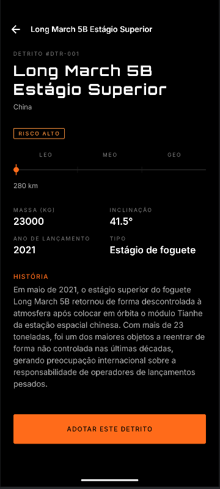
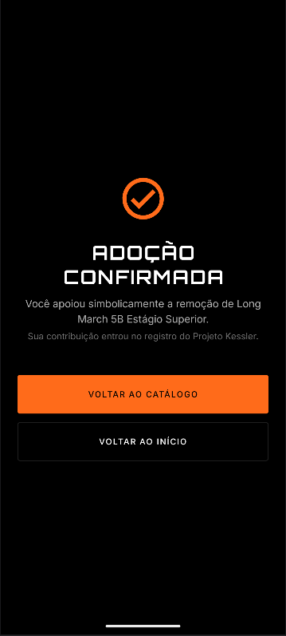

# Kessler

**FIAP Global Solution 2026.1 — 3º ano Sistemas de Informação (Flutter)**

> Antes que a cascata comece.

---

## Sobre o projeto

Kessler é um catálogo mobile de detritos espaciais em órbita da Terra, construído em Flutter como parte da Global Solution 2026.1 da FIAP. O nome é uma referência à **Síndrome de Kessler**, cenário teorizado em 1978 pelo cientista Donald J. Kessler em que uma colisão orbital gera uma reação em cascata de novas colisões, capaz de inutilizar faixas inteiras do espaço próximo. O app reúne origem, missão, altitude, massa, inclinação orbital e nível de risco de 16 fragmentos representativos, conta a história por trás de cada um e permite que o usuário acompanhe (monitorar) ou apoie simbolicamente a remoção (adotar) de qualquer detrito do catálogo.

A identidade visual segue a linguagem **Space Connect / Marte sobre preto** da FIAP: tipografia Orbitron na marca, paleta laranja Marte sobre preto absoluto, cantos retos e ausência de sombras, com decorações orbitais e barra de altitude construídas inteiramente em `CustomPainter` para não depender de assets de imagem.

---

## Telas

| # | Tela | Descrição |
|---|---|---|
| 1 | Splash | Logo PROJETO KESSLER com decoração orbital, avança sozinha após ~2,5s. |
| 2 | Introdução | Carrossel de 3 páginas explicando o problema dos detritos, com botões avançar/voltar, pular e indicador de páginas. |
| 3 | Home | Marca, tagline, bloco de estatísticas (total, massa em toneladas, monitorados) e acesso ao catálogo e à página sobre. |
| 4 | Catálogo | `ListView.builder` com filtros por risco e cards de cada detrito. |
| 5 | Detalhe | Identificação, badge de risco, barra de altitude orbital, grade de informações e história autoral. Permite monitorar e adotar. |
| 6 | Confirmação | Confirmação visual da adoção simbólica com retorno ao início. |
| 7 | Sobre | Explicação do projeto, ODS relacionados e créditos da equipe. |

Capturas de tela em `docs/screens/` (versão de referência da identidade visual).






---

## Como executar

Pré-requisitos: Flutter 3.24+ e Dart 3.5+. A primeira execução faz download das fontes Orbitron e Inter via `google_fonts`, portanto é necessário conexão à internet inicial.

```bash
flutter pub get
flutter create .   # gera pastas android/ios/web caso ainda não existam
flutter run
```

Para gerar um APK release:

```bash
flutter build apk --release
```

---

## Stack

- Flutter (Material 3, tema escuro)
- Dart 3.5+
- `provider` 6.x para estado global
- `google_fonts` 6.x para Orbitron e Inter
- `flutter_lints` 4.x

Sem BLoC, sem Riverpod, sem GetX, sem `go_router`. Navegação por `Navigator` com `MaterialPageRoute` tipado.

---

## Estrutura de pastas

```
lib/
├── main.dart
├── data/
│   ├── models/
│   │   ├── debris.dart
│   │   └── risk_level.dart
│   └── repositories/
│       └── debris_repository.dart
├── state/
│   └── app_state.dart
├── theme/
│   ├── app_colors.dart
│   └── app_typography.dart
├── widgets/
│   ├── altitude_bar.dart
│   ├── debris_card.dart
│   ├── filter_chips_row.dart
│   ├── orbital_decoration.dart
│   ├── primary_button.dart
│   └── risk_badge.dart
└── screens/
    ├── about_screen.dart
    ├── catalog_screen.dart
    ├── confirmation_screen.dart
    ├── detail_screen.dart
    ├── home_screen.dart
    ├── intro_screen.dart
    └── splash_screen.dart
```

---

## Requisitos atendidos

| # | Requisito | Pontos | Onde é atendido |
|---|---|---|---|
| 1 | Tela de Splash com logo | 0,5 | `lib/screens/splash_screen.dart` |
| 2 | Tela de Introdução com botões e descrição | 1,0 | `lib/screens/intro_screen.dart` |
| 3 | Navegação entre 4+ telas (sem contar splash/intro) | 2,0 | 5 telas: Home, Catálogo, Detalhe, Confirmação, Sobre |
| 4 | Column, Row, Card, ListView, Scaffold | 2,0 | Presentes em todas as telas e widgets |
| 5 | Lista mockada relacionada ao tema | 1,5 | `lib/data/repositories/debris_repository.dart` (16 detritos) |
| 6 | Interação: botões, filtros, seleção, atualização | 2,0 | Filtros por risco, seleção no catálogo, monitorar, adotar |
| 7 | Organização, boas práticas, estados/recomposição, reuso | 1,0 | Camadas separadas, `ChangeNotifier` + Provider, widgets reaproveitados |

**Total: 10,0.**

---

## Estado e recomposição

A classe `AppState` em `lib/state/app_state.dart` estende `ChangeNotifier` e centraliza dois pedaços de estado global:

- `selectedRisk` — o filtro de risco ativo no catálogo
- `monitoredIds` — o conjunto de detritos marcados como monitorados pelo usuário

O app é envolvido em um `ChangeNotifierProvider<AppState>` em `main.dart`. Telas leem o estado com `context.watch<AppState>()` quando precisam reconstruir (Home, Catálogo, Detalhe) e com `context.read<AppState>()` em callbacks de botão (Detalhe, FilterChipsRow). Isso demonstra recomposição de forma visível para o avaliador: marcar um detrito como monitorado dentro do Detalhe atualiza imediatamente o contador "MONITORADOS" exibido no bloco de estatísticas da Home, sem qualquer recarregamento manual.
