# Kessler

**FIAP Global Solution 2026.1 — 3º ano Sistemas de Informação (Flutter)**

> Antes que a cascata comece.

---

## Sobre o projeto

Kessler é um catálogo mobile/web de detritos espaciais em órbita da Terra, construído em Flutter para a Global Solution 2026.1 da FIAP. O nome é uma referência à **Síndrome de Kessler**, cenário teorizado em 1978 por Donald J. Kessler em que uma colisão orbital gera uma reação em cascata de novas colisões, capaz de inutilizar faixas inteiras do espaço próximo. O app reúne origem, missão, altitude, massa, inclinação orbital e nível de risco de 16 fragmentos representativos, conta a história por trás de cada um e permite que o usuário se identifique, acompanhe (monitorar), salve numa lista pessoal e apoie simbolicamente a remoção (adotar) de qualquer detrito do catálogo.

A identidade visual segue a linguagem **Space Connect / Marte sobre preto** da FIAP: tipografia Orbitron na marca, paleta laranja Marte sobre preto absoluto, cantos retos e ausência de sombras, com decorações orbitais e barra de altitude construídas inteiramente em `CustomPainter` para não depender de assets de imagem.

---

## Telas

Todas as capturas a seguir foram tiradas com o app rodando em **Chrome (web)** numa viewport desktop de **1280×800** via `flutter run -d chrome` + driver Puppeteer headless.

### 1. Splash
Logo PROJETO KESSLER com decoração orbital em `CustomPainter`. Avança sozinha para a Introdução após ~2,5s.

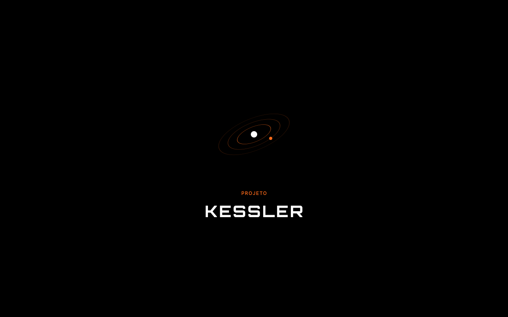

### 2. Introdução — página 1 de 3
Carrossel `PageView` explicando o problema dos detritos. Botões VOLTAR/AVANÇAR no rodapé, atalho PULAR no topo e indicador de páginas em pontos.

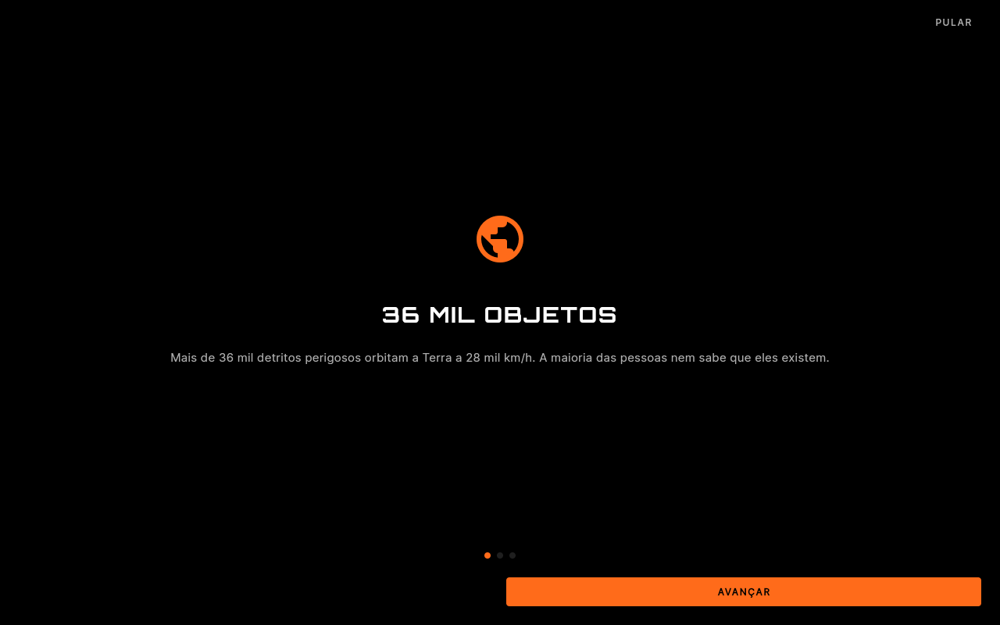

### 3. Introdução — página 2 de 3
Síndrome de Kessler — a reação em cascata de colisões.


### 4. Introdução — página 3 de 3
Última página: AVANÇAR vira COMEÇAR e leva ao Login.

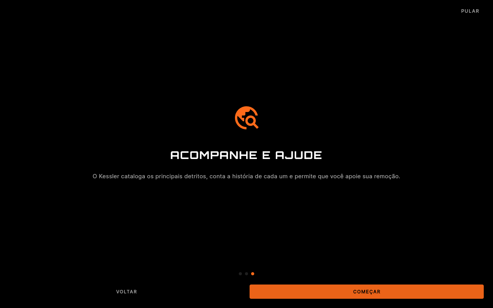

### 5. Login — estado inicial
Coleta nome (`TextField`), gênero (chips selecionáveis MASCULINO/FEMININO/OUTRO), idade (`Slider` 14–80) e país (`DropdownButton` com 5 opções). Botão ENTRAR começa desabilitado (cinza) até o nome ter ao menos 2 caracteres.

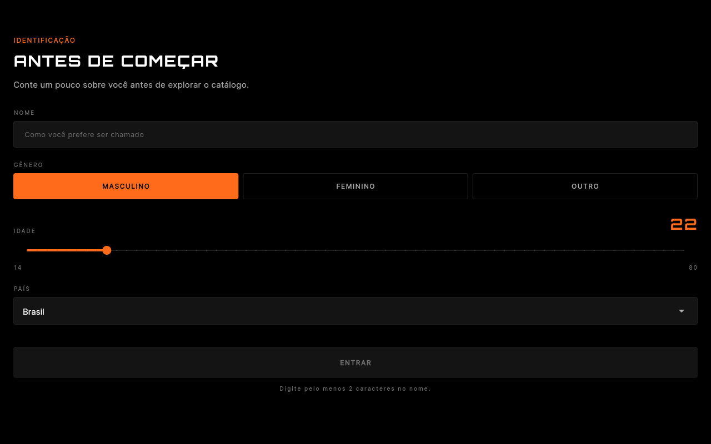

### 6. Login — preenchido
Nome digitado, FEMININO selecionado, slider movido para 50 anos. Botão ENTRAR habilitado (laranja).

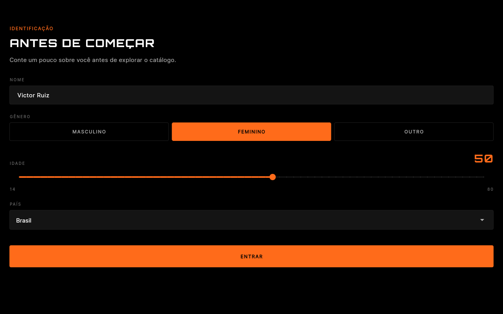

### 7. Home
Saudação personalizada `BEM-VINDO, [NOME]` + linha gênero · idade · país no card de estatísticas. Card mostra total de detritos (16), massa total em toneladas e contador de MONITORADOS em tempo real. Três botões: EXPLORAR CATÁLOGO (primário), MEUS DETRITOS (n) e SOBRE O PROJETO.

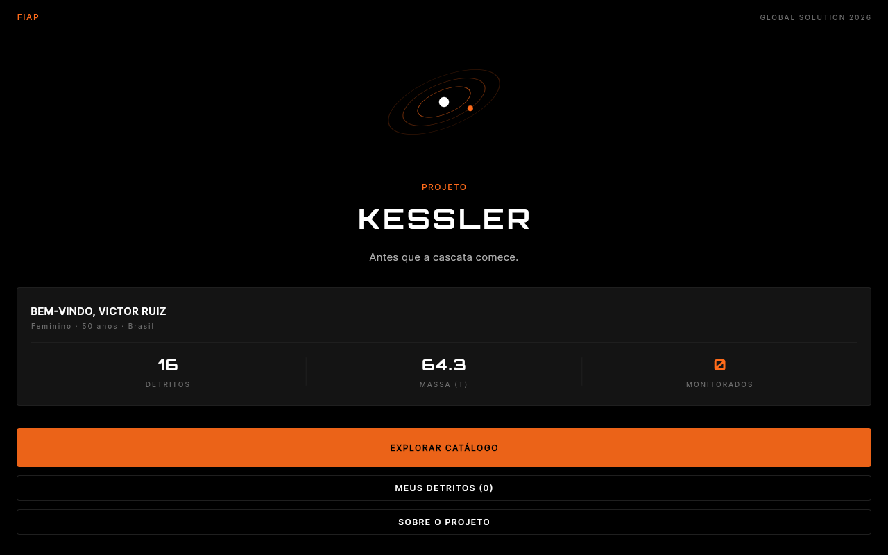

### 8. Catálogo — filtro TODOS
`ListView.builder` sobre os 16 detritos. Cada card mostra ID, risco, nome, país·ano e mini-métricas (altitude, massa, inclinação).

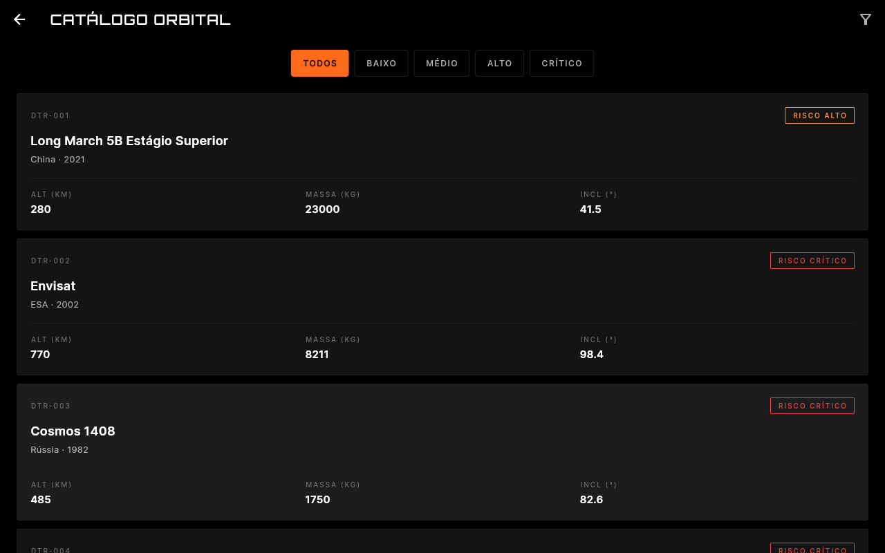

### 9. Catálogo — filtro CRÍTICO
Filtros funcionais por nível de risco. Selecionar CRÍTICO restringe a lista aos 4 detritos críticos (Envisat, Cosmos 1408, Fengyun-1C, Cosmos 1818).

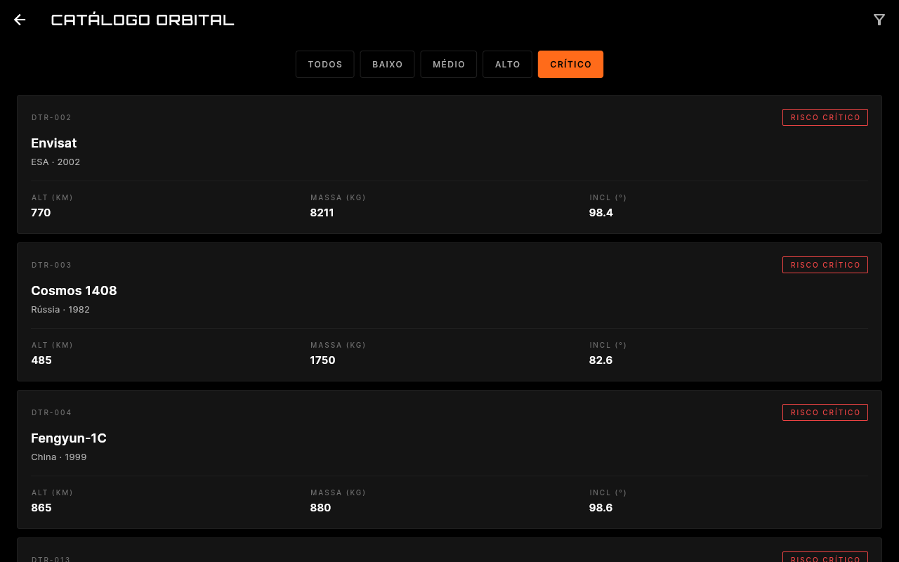

### 10. Detalhe
Identificação, badge de risco, barra de altitude orbital (`CustomPainter` em LEO/MEO/GEO), grade de informações e história autoral. Botões MONITORAR e ADOTAR.

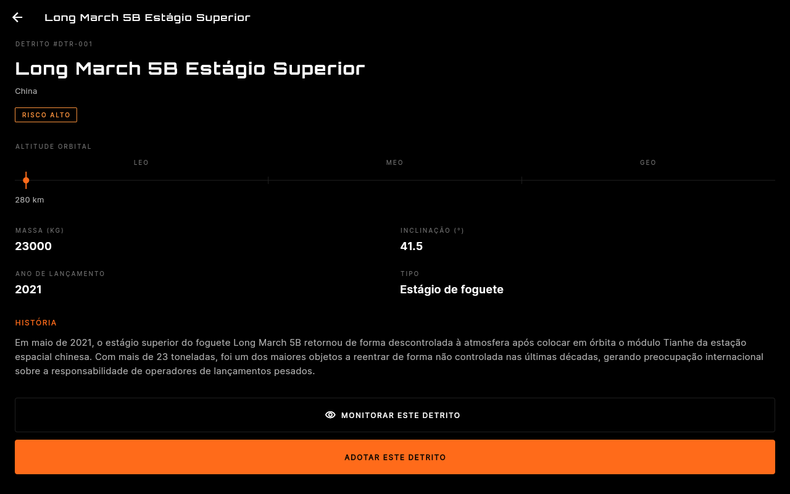

### 11. Detalhe — monitorando
Após tocar MONITORAR, o botão troca para `✓ MONITORANDO` em laranja. O contador da Home e a tela MEUS DETRITOS recebem o detrito imediatamente (recomposição via `ChangeNotifier`).

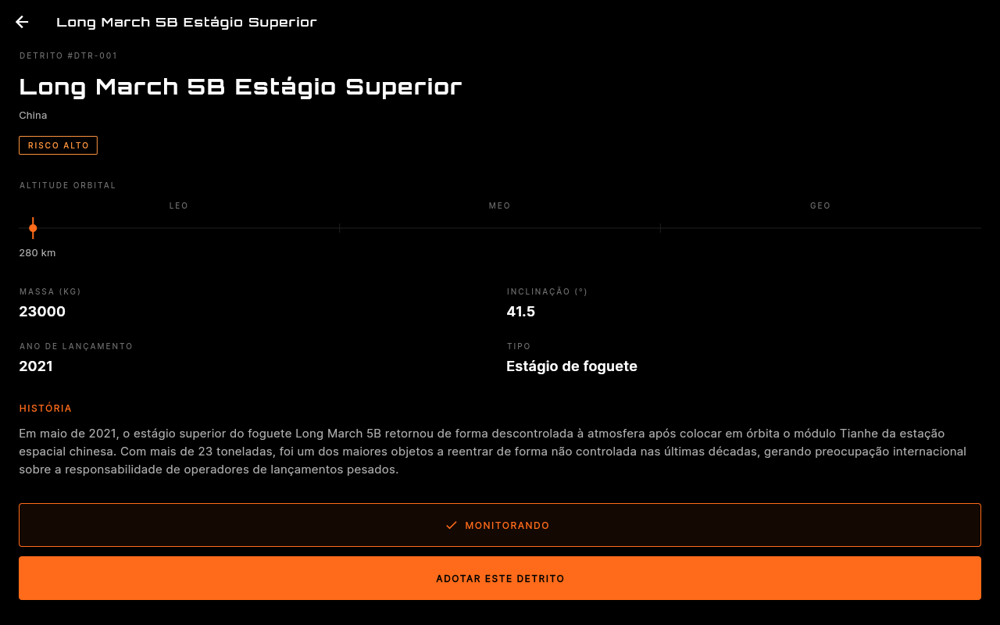

### 12. Confirmação de adoção
Após tocar ADOTAR, confirmação visual com check em laranja, nome do detrito e dois botões de retorno.

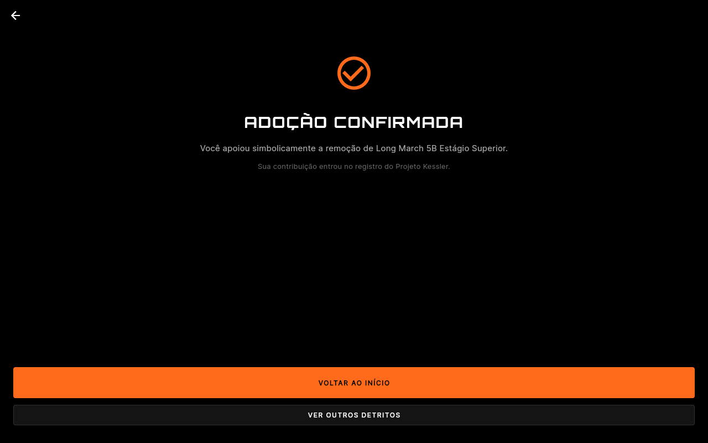

### 13. Meus Detritos
Lista dos detritos salvos pelo usuário (cruzando `monitoredIds` com o catálogo). Acessível pela Home. Conta detritos no topo e reusa o mesmo `DebrisCard` do catálogo.

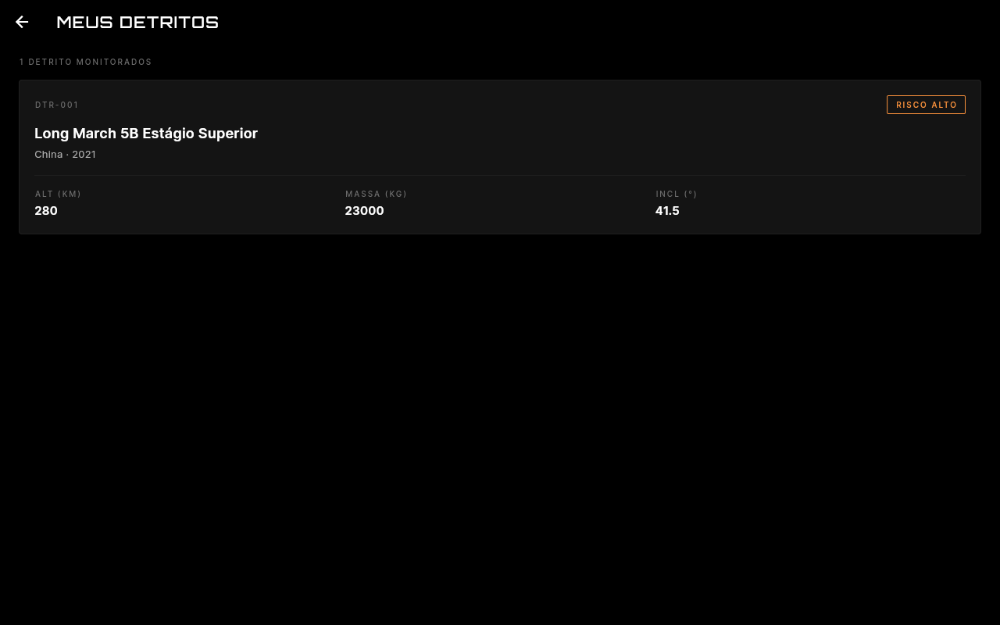

### 14. Sobre o projeto
Explicação da Síndrome de Kessler, ODS relacionados (9 e 13) e créditos da equipe.

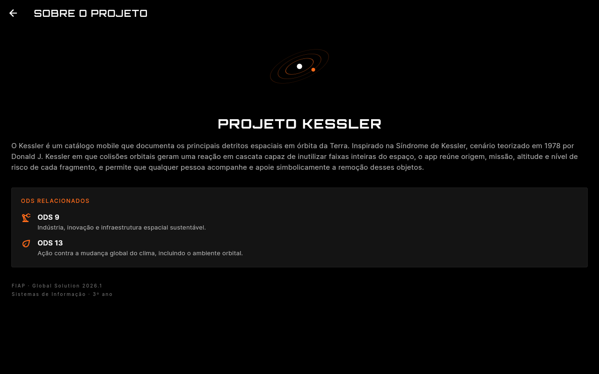

---

## Como executar

Pré-requisitos: Flutter 3.24+ e Dart 3.5+. A primeira execução faz download das fontes Orbitron e Inter via `google_fonts`, portanto é necessário conexão à internet inicial.

```bash
flutter pub get
flutter create .   # gera pastas android/ios/web caso ainda não existam
flutter run -d chrome
```

Para gerar um APK release:

```bash
flutter build apk --release
```

> **Windows com espaço no caminho:** se o projeto estiver em `C:\Users\<Nome Com Espaço>\...`, o `flutter build web` quebra por um bug do hook native_assets do `objective_c`. Solução: copiar o projeto para `C:\<nome>` (sem espaços) e setar `PUB_CACHE=C:\pub_cache` antes do `pub get`.

---

## Stack

- Flutter (Material 3, tema escuro)
- Dart 3.5+
- `provider` 6.x para estado global (`ChangeNotifier`)
- `google_fonts` 6.x para Orbitron e Inter
- `flutter_lints` 4.x

Sem BLoC, sem Riverpod, sem GetX, sem `go_router`. Navegação por `Navigator` com `MaterialPageRoute` tipado.

---

## Estrutura de pastas

```
lib/
├── main.dart
├── data/
│   ├── models/
│   │   ├── debris.dart
│   │   ├── risk_level.dart
│   │   └── user_profile.dart
│   └── repositories/
│       └── debris_repository.dart
├── state/
│   └── app_state.dart
├── theme/
│   ├── app_colors.dart
│   └── app_typography.dart
├── widgets/
│   ├── altitude_bar.dart
│   ├── debris_card.dart
│   ├── filter_chips_row.dart
│   ├── orbital_decoration.dart
│   ├── primary_button.dart
│   └── risk_badge.dart
└── screens/
    ├── about_screen.dart
    ├── catalog_screen.dart
    ├── confirmation_screen.dart
    ├── detail_screen.dart
    ├── home_screen.dart
    ├── intro_screen.dart
    ├── login_screen.dart
    ├── saved_screen.dart
    └── splash_screen.dart
```
---

## Estado e recomposição

A classe `AppState` em `lib/state/app_state.dart` estende `ChangeNotifier` e centraliza três pedaços de estado global:

- `user` — perfil preenchido no Login (`UserProfile`: nome, gênero, idade, país)
- `selectedRisk` — filtro de risco ativo no Catálogo
- `monitoredIds` — conjunto de IDs dos detritos salvos pelo usuário

O app é envolvido em um `ChangeNotifierProvider<AppState>` em `main.dart`. Telas leem o estado com `context.watch<AppState>()` quando precisam reconstruir (Home, Catálogo, Detalhe, Meus Detritos) e com `context.read<AppState>()` em callbacks (Login, Detalhe, FilterChipsRow). Isso demonstra recomposição visível para o avaliador: ao tocar MONITORAR num detrito, o contador "MONITORADOS" do card de estatísticas da Home e o contador "MEUS DETRITOS (n)" do botão se atualizam imediatamente, e o detrito aparece na lista de Meus Detritos sem nenhum reload manual.
